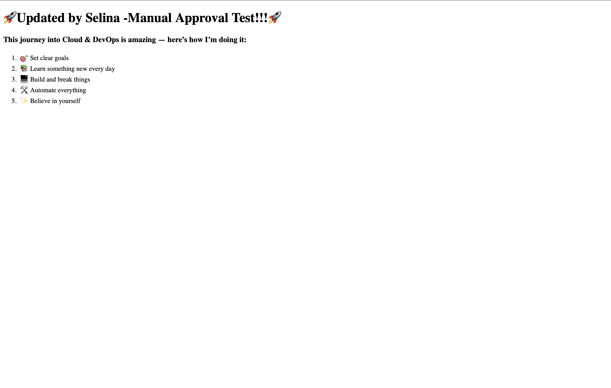

🌐 Part 2: Cloud Resume — Complex Phase

This is Part 2 of my Cloud Resume CI/CD journey. In this phase, I implemented:

- ✅ A CloudFront Distribution for global website performance
- ✅ Automated caching/invalidation on deploy
- ✅ A beautiful professional resume template
- ✅ Continued use of CI/CD best practices

🚀 Live CloudFront URL

📸 Final Preview

🛠️ What I Did

🔸 Setup CloudFront
- Used S3 as the origin
- Restricted bucket access via OAI (Origin Access Identity)
- Configured cache behavior and TTLs
- Enabled HTTPS with default SSL cert

🔸 Resume Upgrade
- Downloaded a free HTML/CSS resume template
- Customized it to reflect my personal cloud journey
- Replaced previous `index.html`

🔸 CI/CD with CloudFront
- Pipeline still triggers from GitHub → S3
- Future enhancement: add Lambda@Edge for logging or headers

📸 Screenshots

_You can drag and drop screenshots here in GitHub after uploading._

What I Learned

- How CDN caching works with S3 + CloudFront
- How to secure S3 buckets while using CloudFront
- Real-world resume customization for online delivery
- Continued practice with Git/GitHub and CI/CD

👋🏽 About Me

I’m Selina Loggins, passionate about cloud engineering, DevOps, and helping others break into tech.  
This project showcases real tools and real growth. Let’s connect on [LinkedIn](https://www.linkedin.com/in/selinaloggins)!

