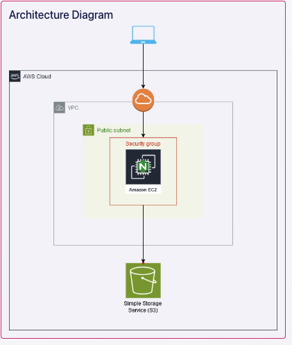

## 🚀 CI/CD Static Website Project – Part 3: Complex Phase

This final phase introduced real-world production safeguards and automation features.

### 🔧 Features Implemented

- ✅ Created an Origin Access Control (OAC) to restrict S3 access to CloudFront only  
- ✅ Resolved Access Denied errors by updating the S3 bucket policy  
- ✅ Enabled manual approval stage in AWS CodePipeline for production deployments  
- ✅ Updated bucket content to show successful deploy after approval  
- ✅ Verified the deployment via CloudFront  

### 🌍 Live URL  
**https://d1zllftq6xl906.cloudfront.net**

### 🖼️ Screenshot  

### 💡 Key Lessons

- Correctly linking CloudFront to a private S3 bucket requires OAC + updated bucket policy  
- Manual approvals can help protect against accidental changes in production  
- Public access must be off when OAC is enabled

---

### 🔜 Coming Soon

- Contact form (serverless)  
- Page view counter with DynamoDB  

🎉 This completes the Complex Phase of my CI/CD pipeline project!

