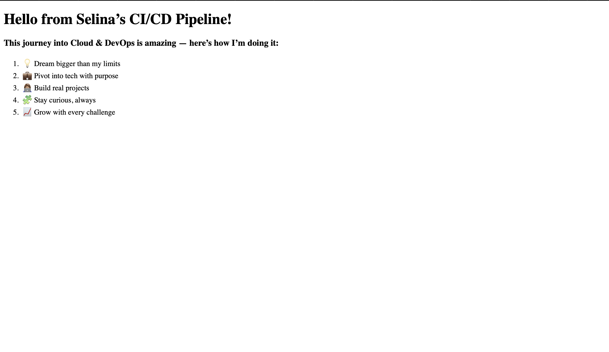

# 🚀 Cloud Resume Static Site — CI/CD with AWS CodePipeline

This project automates the deployment of a personal static website using **GitHub**, **Amazon S3**, and **AWS CodePipeline**. Inspired by the [Cloud Resume Challenge](https://cloudresumechallenge.dev/), it's my foundational hands-on project in Cloud & DevOps.

---

## 🌐 Live Website

**[View Site](http://cloud-resume-static-site-selina.s3-website-us-east-1.amazonaws.com)**  
Hosted via S3 Static Website Hosting and deployed via CodePipeline.

---

## 🧠 Project Goals

- Learn the end-to-end deployment process using AWS services
- Replace manual updates with an automated pipeline
- Gain confidence using Git, S3, IAM, and CodePipeline
- Tell my unique Cloud & DevOps journey through a live project

---

## ⚙️ Technologies Used

| Tool | Purpose |
|------|---------|
| **GitHub** | Source code version control and CI/CD trigger |
| **AWS S3** | Static website hosting |
| **AWS CodePipeline** | CI/CD pipeline to automate deployment |
| **Terminal (macOS)** | Git + nano usage |
| **HTML5** | Static front-end code |
| **IAM** | Secure permissions for CodePipeline to access S3 |

---

## 🛠️ Features

- ✅ Static website hosted on Amazon S3
- ✅ Automatically deploys on push to GitHub `main`
- ✅ UTF-8 encoding fixed for emoji compatibility
- ✅ Public bucket policy for website access
- ✅ Fixed 403 errors, formatting, and display issues

---

## 📄 File Structure

---

## 📸 Final Preview

---

## 🐛 Challenges Overcome

- **403 Access Denied**: Solved via bucket policy + public access settings  
- **Emoji rendering issues**: Fixed by adding UTF-8 meta tag  
- **HTML displaying as plain text**: Resolved by saving in plain text format via nano  
- **GitHub push errors**: Fixed with `git pull origin main --rebase`

---

## 📌 Next Phase (Advanced)

- Add manual approval stage in CodePipeline
- Integrate AWS CloudFront for performance and global delivery

---

## 🧠 Lessons Learned

This project helped me sharpen real-world cloud skills and build confidence in deploying live applications from scratch. It showed me that **automation + creativity = power**.

---

## 👋🏽 About Me

I’m **Selina Loggins**, a cloud engineering student and passionate builder in tech.  
Let’s connect on [LinkedIn](https://www.linkedin.com/in/selinaloggins)!

---

